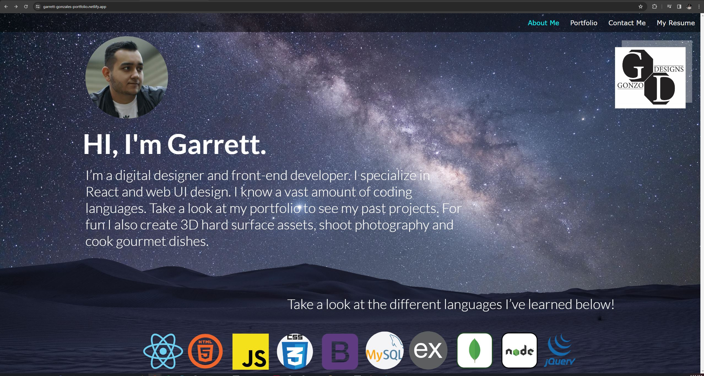
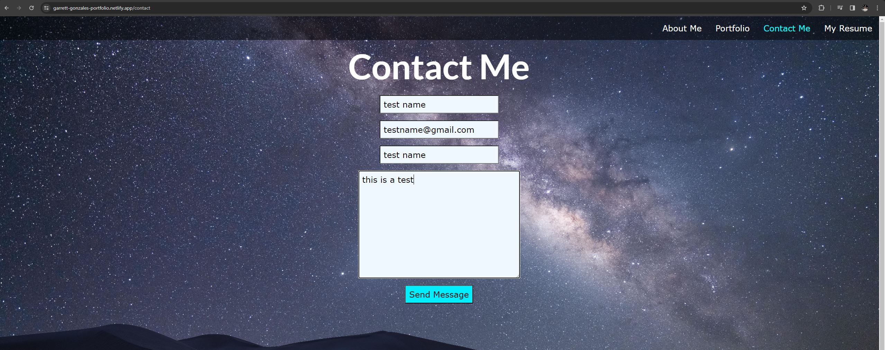
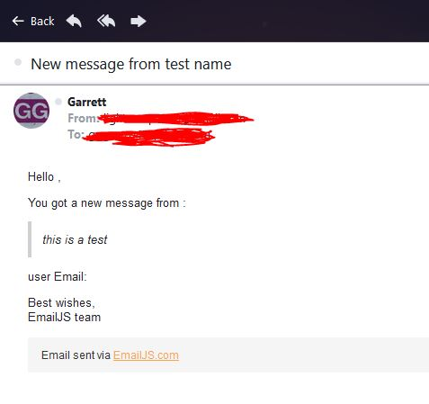

# My-React-Portfolio

## User Story

AS A student

I WANT to build a fully functional portfolio website

SO THAT my website can present all my past projects, info about me, a contact list and my resume

## Acceptance Criteria

GIVEN a that the website is fully functionable

WHEN I successfully assemble a working nav bar that takes the user to about me, portfolio, contact me and a resume page

WHEN I create a working about me page that shows info about me, the coding languages ive learned

WHEN I create a portfolio page with all my past projects

WHEN I create a contact me page that sends the users inputed info to my personal email

WHEN I have a resume page that takes the user to a downloadable version of my resume

When I have a good-looking website

## Deployed URL

https://garrett-gonzales-portfolio.netlify.app/

## Website Screenshot

## Contact Me Screenshot Function Proof

